# webterminal 0.1 操作手冊

# 創建資產

## 添加憑證
點擊憑證列表，新增；協議支持ssh-key、sh-password、RDP、telnet等；憑證列表主要用於管理遠程主機時的賬號、密碼，及使用的遠程協議。

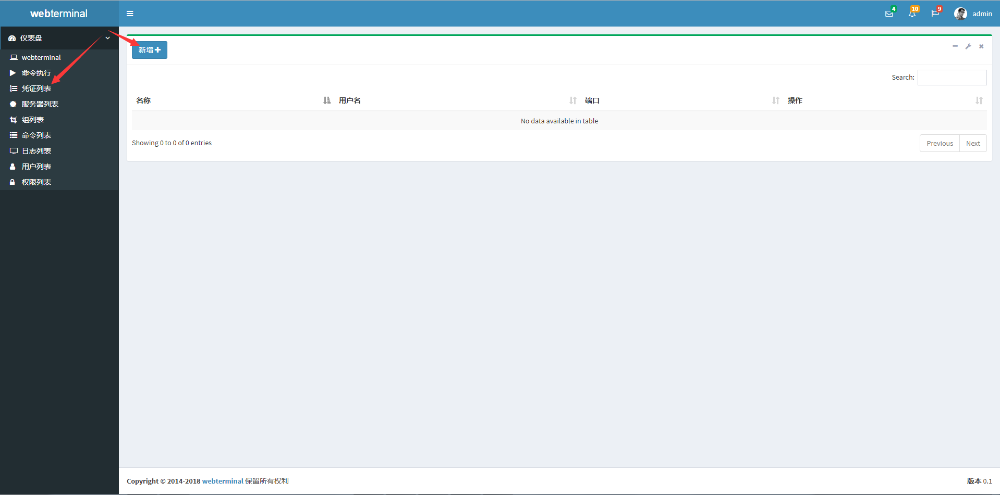

這裡以sh-password為例。

這裡以rdp為例子。
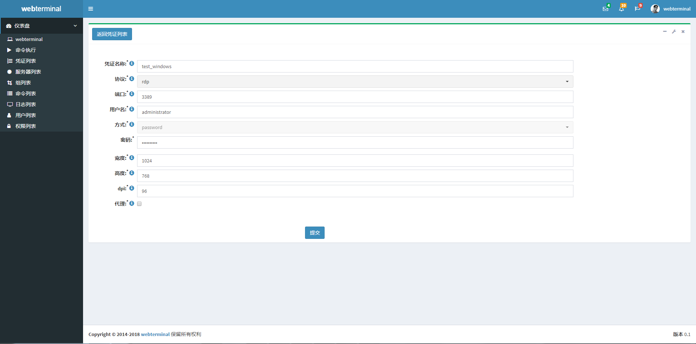

這裡以telnet為例子。(註意端口號)

這裡以vnc為例子。 如您的vncserver沒有配置用戶名，那麼用戶名隨便寫。

如果你不知道你的vnc端口號是多少的話，可以這樣查看。

## 添加服務器

點擊服務器列表-新增服務器資產

這裡以添加linux 主機為例。憑證選擇剛剛添加的“test_ssh”

這裡以添加windows主機為例。憑證選擇剛剛添加的“test_windows”

這裡以添加linux——VNC主機為例。

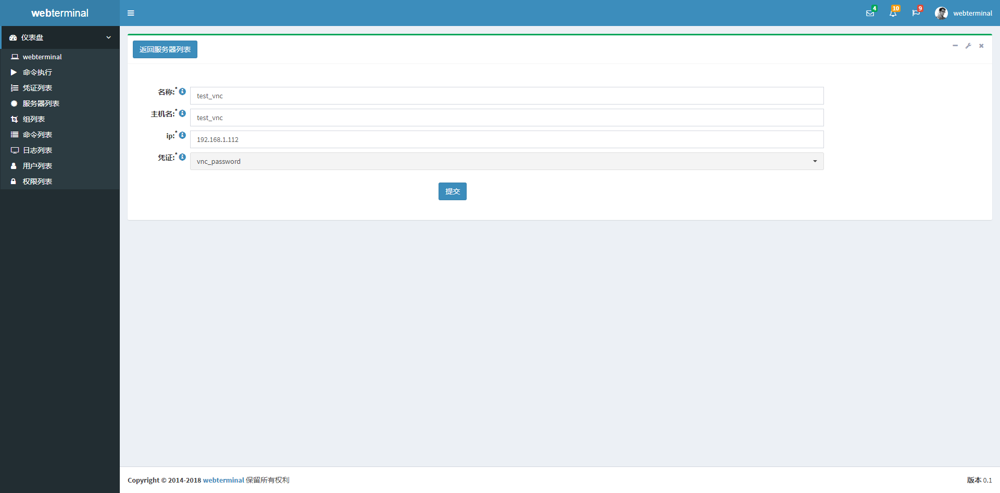

這裡以添加交換機為例。

## 添加服務器組
將服務器添加進組中：點擊組列表。

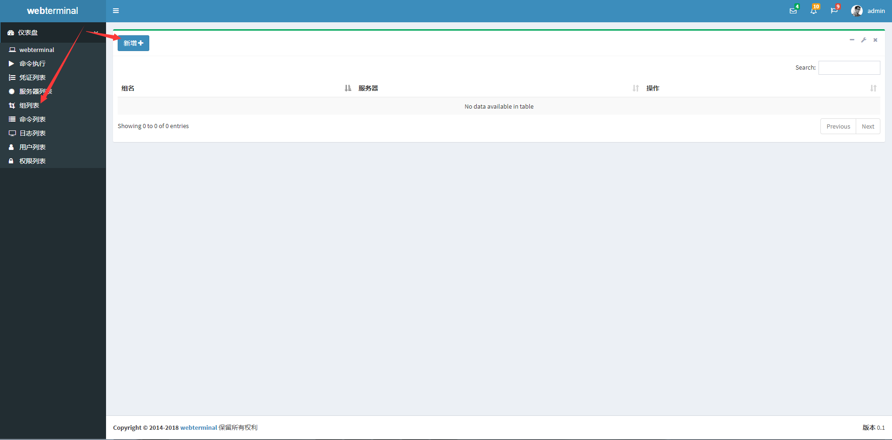

以linux服務器組為例

以windows服務器組為例

以linux-vnc服務器組為例

以Switch服務器組為例

# 創建用戶與授權

## 創建用戶
用戶列表用於管理運維人員登陸賬號

創建用戶

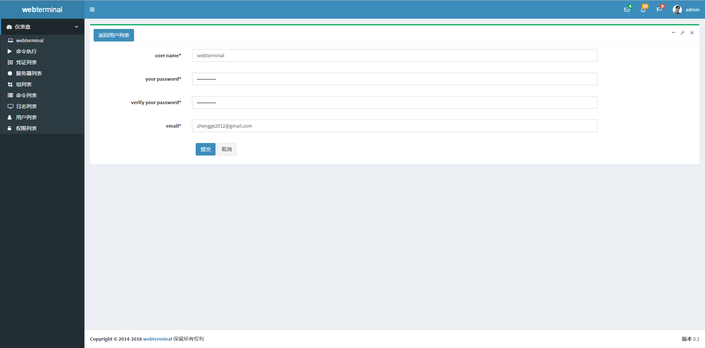

## 用戶授權

點擊權限列表項，下拉可選擇用戶（用戶列表中的用戶）；默認擁有所有權限；權限選擇完。

在最下麵服務器組中作用的服務器組（在組列表中那些組)。

可選擇多服務器組

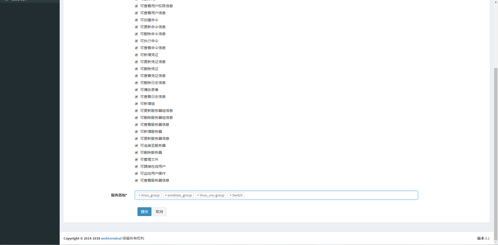

# 使用webterminal連接遠程主機

使用新建立的用戶“webterminal” 登錄。右擊連接。

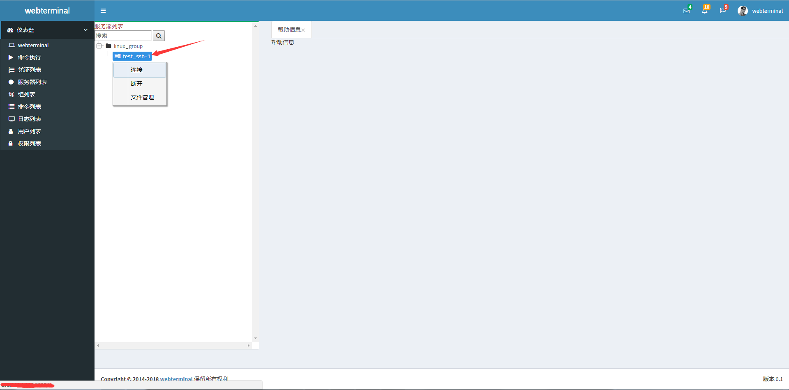

（目前rdp、vnc、telnet協議主機尚不支持文件管理功能）

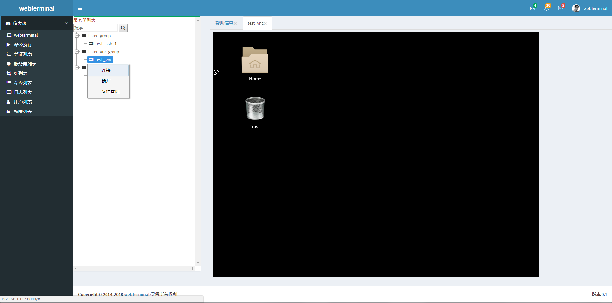
請忽略字體。

# 添加命令用於批量操作

點擊命令列表，新增test命令，在命令執行下可看到多了一個test命令列表，點擊test的執行選項就會對服務器組下的所有主機執行”mkdir test”，

返回到命令執行，選擇主機右擊執行。

可選擇組進行批量執行。

連接主機，發現根目錄下多了一個test.txt文件夾
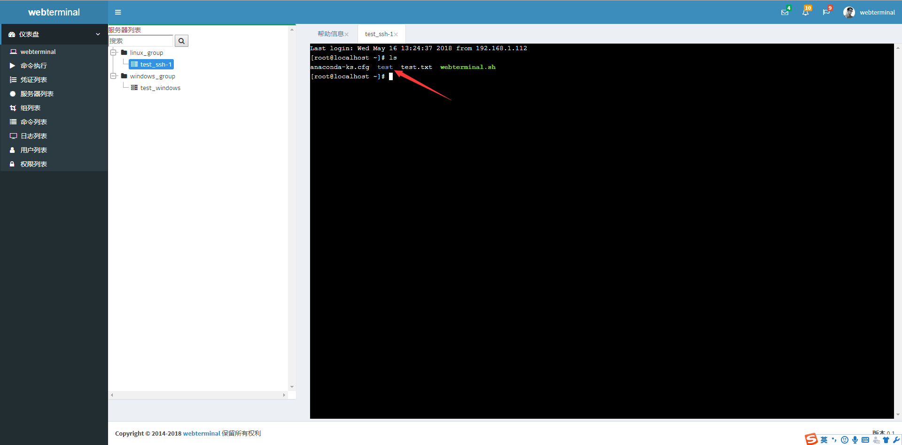

# ssh調用助手使用
註冊ssh調用助手以便於在用戶windows電腦上調用putty軟件連接至服務器,使用方法如下
將軟件目錄helper下webterminal ssh helper.exe安裝包文件安裝至需要連接至服務器的客戶端上。
在服務器列表頁面點擊putty按鈕即可連接至需要連接的服務器

# 日誌列表為連接實時查看與錄像回放

當一個用戶打開一個服務器進行操作時，擁有權限用戶可點擊日誌列表進行監控查看實時動態！
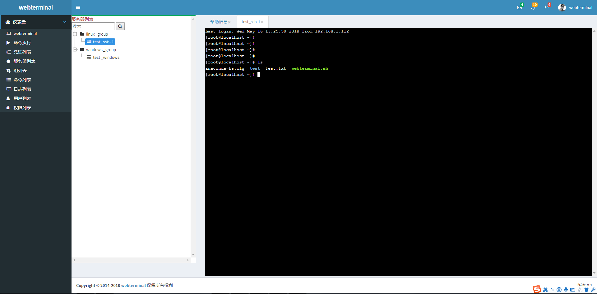

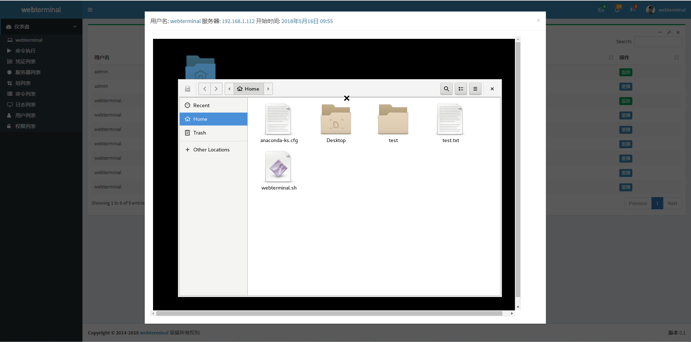
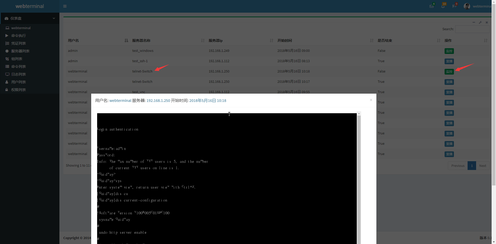

當用戶斷開連接後，擁有權限用戶可查看連接操作歷史錄像回放！
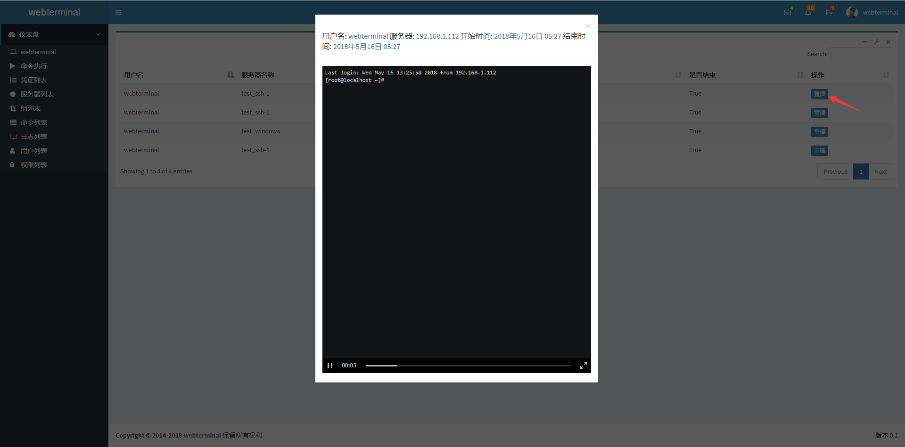
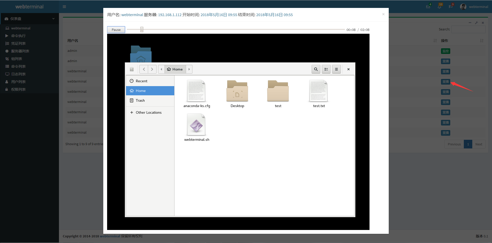
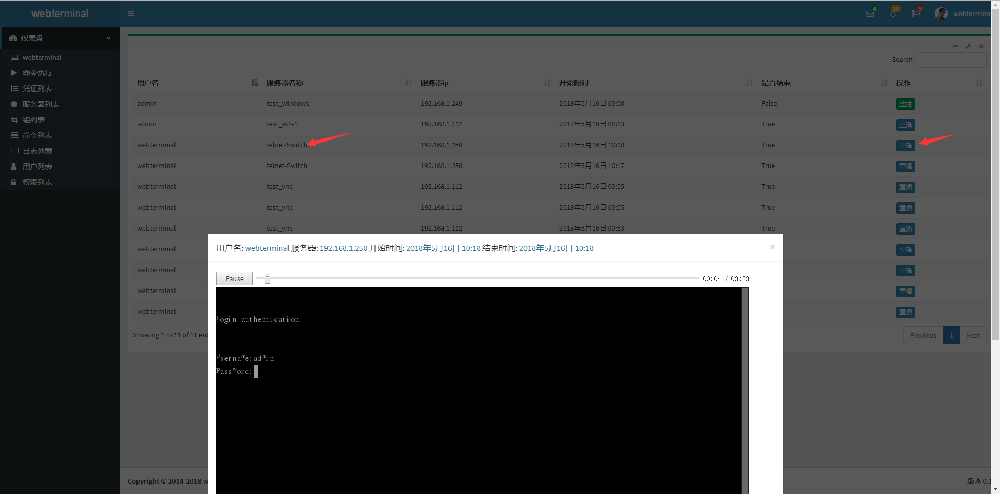
