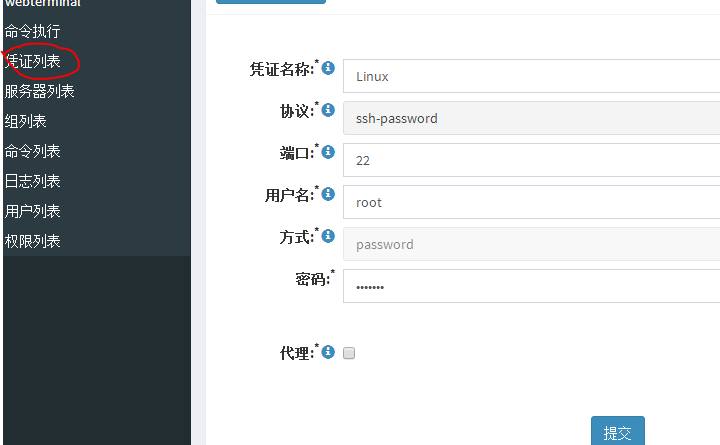
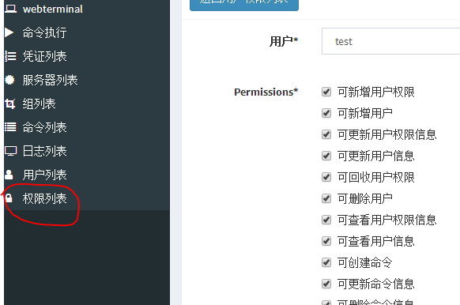
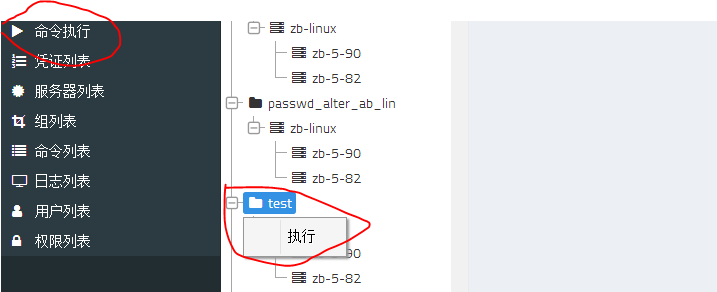

# 操作手冊

# 創建資產
## 添加憑證
點擊憑證列表，新增；協議支持ssh-key，sh-password，RDP等；憑證列表主要用於管理遠程主機時的賬號、密碼，及使用的遠程協議。

## 添加服務器
點擊服務器列表，新增；其中，憑證是前面創建的憑證

## 創建服務器組
將服務器添加進組中：點擊組列表，新增；Add item將之前創建的服務器添加進組中。

# 創建用戶與授權
## 創建用戶
用戶列表用於管理運維人員登陸賬號

## 用戶授權
點擊權限列表項，下拉可選擇用戶（用戶列表中的用戶）；permission為權限，默認擁有所有權限；權限選擇完，在最下麵服務器組中作用的服務器組（在組列表中那些組)

# 使用webterminal連接遠程主機
點擊webterminal，選擇要遠程的主機，點擊連接即可
文件管理功能可操作遠程主機文件

# 添加命令用於批量操作
點擊命令列表，新增test命令
在命令執行下可看到多了一個test命令列表，點擊test的執行選項就會對服務器組下的所有主機執行”mkdir test.txt”，返回到webterminal，連接主機，發現根目錄下多了一個test.txt文件夾

